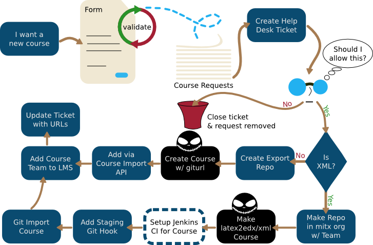
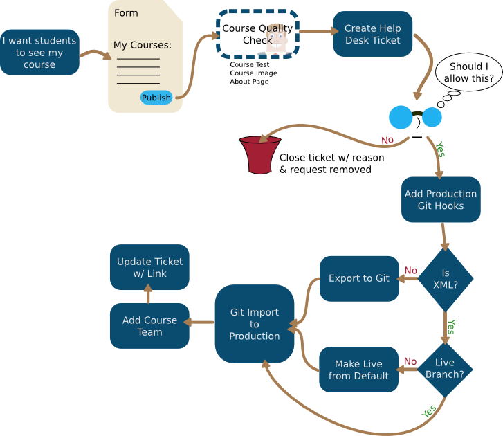
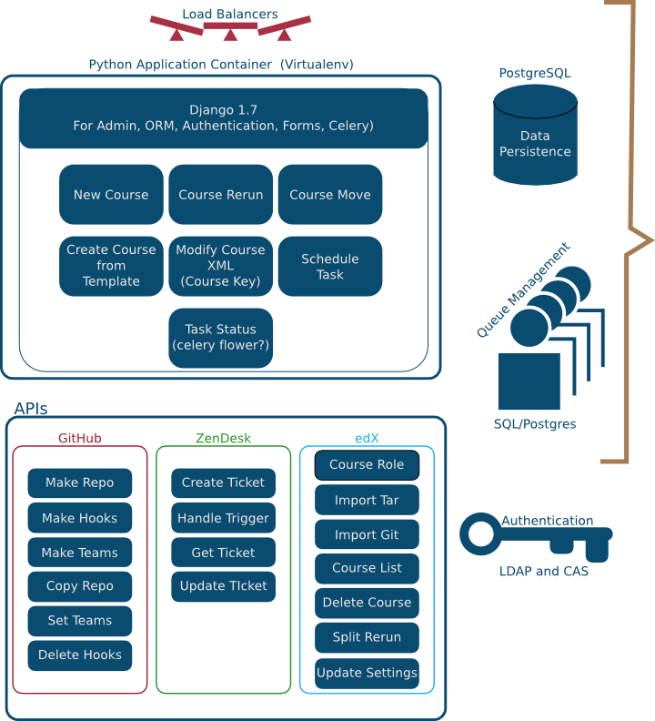
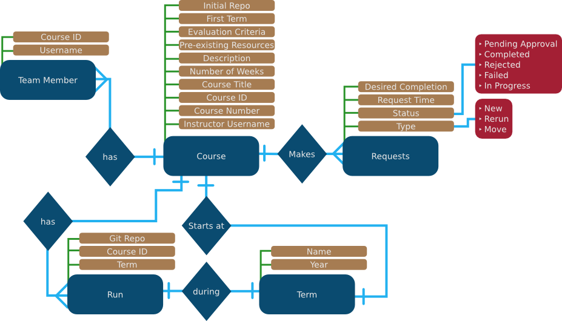

Orcoursetrion (a.k.a. Automatic Course Provisioning X)
======================================================

Workflow, Design, And Architecture
----------------------------------

Quite some time is lost to course provisioning and request management.
This document both defines what course provisioning is, and is a design
for how to create software to assist in automating this process.

There are three major stories/workflows that occur in our course
production/publishing architecture. While all three occur for
residential MITx, some of them also apply and could be used for use with
MOOC/Open Education.

The three major process flows are:

-  Creating a brand new course
-  Publishing a course to our student facing LMS
-  Rerunning an already existing course

Creating a Brand New Course
---------------------------

   New Course

Areas of note
~~~~~~~~~~~~~

-  Setting up Jenkins CI for the course is doable, but is left in cutout
   in the diagram as it is a quite complex and not required for course
   provisioning.
-  The form needs to both programmatically validate course team members,
   and the ``course id`` entered (i.e. 8.01r). It is intended that the
   validation for ``course id`` will either use the edX-Platform course
   listing API directly to check for duplicates, or maintain a (mostly)
   complete list of all current courses internally
-  A fully automatic mode could be supported without the help desk
   ticket approval step.

Moving a Course from Staging to Production
------------------------------------------

   Moving a Course

Areas of note
~~~~~~~~~~~~~

-  The course quality check could potentially be done by a jenkins job,
   or ACPx could provide that feature itself since it will already have
   to be somewhat courseware capable.
-  Similar to a new course, the approval process can be skipped here

Rerunning a Course
------------------

.. figure:: _static/img/course_rerun.png
   :alt: Rerunning a Course

   Rerunning a Course

Areas of note
~~~~~~~~~~~~~

-  This is pretty much a blend of the move and rerun flows, and only
   adds the rerun edX platform call, the deletions, and the giturl
   update.
-  As an option, instead of doing the split rerun function above, we
   could potentially use the same flow as the git course by deleting it,
   modifying the course XML (and using an XML cleanup script i.e.
   `Piotr's Cleanup Script <https://github.com/pmitros/edxml-tools>`__,
   and re-importing.

System Architecture
-------------------

   System Architecture diagram

Areas of note
~~~~~~~~~~~~~

-  None of the APIs for edx-platform currently exist and will likely
   have to be replaced with instruction updates to the helpdesk tickets
   instructing the agent to perform the requested task and provide
   instructions that make it as quickj and easy as possible for the
   agent to do so, and mark them complete.
-  We have two of the eight needed API calls implemented in a feature
   branch:

   -  Import Tar
   -  Course List and we can likely easily add the rest if that feature
      branch is merged.

Data Structure/Entity Relationship Diagram
------------------------------------------

Below is an `Oracle
style <http://docs.oracle.com/cd/A87860_01/doc/java.817/a81358/05_dev1.htm>`__
ERD diagram, but I do not presuppose the database choice, and do not
think it is neccessary to use a traditional RDBMS as the persistance
layer in the application. The persistence area is a flexible area within
the architecture since even a simple document store would likely be
adequate.

   Entity Relationship Diagram

